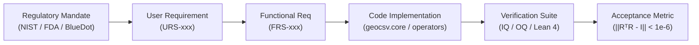

# Requirements Traceability Matrix (RTM-001)

**System:** GeoCSV-AI (Geometric Computer Systems Validation Harness)  
**Standard:** FDA 21 CFR Part 11 / GAMP 5 Category 4 / NIST AI RMF 1.0  
**Effective Date:** October 2026  
**Document ID:** DOC-VAL-RTM-001-REV1  

---

## 1. Traceability Architecture

The Requirements Traceability Matrix enforces 100% bidirectional verification across all levels of the software lifecycle:
1. **Funder / Regulatory Mandate** (BlueDot, NIST AI RMF, FDA 21 CFR 11)
2. **User Requirements Specification (URS)**
3. **Functional Requirements Specification (FRS)**
4. **Engineering Specification (SPEC)**
5. **Qualification Protocol (IQ / OQ / PQ)**
6. **Mathematical Acceptance Threshold**

---

## 2. Master Verification Matrix

| Mandate ID | User Requirement (URS) | Functional Requirement (FRS) | Implementation Module | Verification Protocol ID | Mathematical Acceptance Criteria | Status |
| :--- | :--- | :--- | :--- | :--- | :--- | :--- |
| **NIST MEAS 1.1** | **URS-STIEFEL-001**: Parameter updates must prevent representation superposition. | **FRS-CORE-001**: Enforce Stiefel manifold projection via Sherman-Morrison-Woodbury Cayley retraction in $\mathcal{O}(dr^2)$. | `geocsv.core.cayley.ExactCayleyRetraction` | `IQ-TEST-001` `test_cayley_isometry.py` | Frobenius norm error: $$\|\mathbf{R}^T \mathbf{R} - \mathbf{I}\|_F < 1.0 \times 10^{-6}$$ | **QUALIFIED** |
| **FDA 11.10(a)** | **URS-DETERMIN-002**: Weight loading and kernel JIT compilation must be bit-level deterministic. | **FRS-METR-001**: Generate deterministic SHA-256 digests over sorted model weights and AST graph signatures. | `geocsv.metrology.iq.InstallationQualification` | `IQ-TEST-002` `test_installation_qualification_tamper_evident.py` | 100% hash parity across 1,000 cold boots with fixed seed. | **QUALIFIED** |
| **FDA 11.10(e)** | **URS-AUDIT-003**: All steering interventions and verification runs must create tamper-evident audit logs. | **FRS-METR-002**: Output RFC 3161 compliant JSON certificates cryptographically signed with HMAC-SHA-256. | `geocsv.metrology.iq` / `iq_stiefel.py` | `IQ-TEST-003` `iq_stiefel.py` | Cryptographic signature length = 64 hex characters; UTC timestamp validation. | **QUALIFIED** |
| **ARC-AGI-SPAT** | **URS-SPATIAL-004**: Discrete 64×64 abstraction grid transformations must incur zero rasterization error. | **FRS-OPER-001**: 2D Kronecker-Cayley Spatial Operator ($\mathbf{R}_{\text{grid}} = \mathbf{R}_{\text{row}} \otimes \mathbf{R}_{\text{col}}$). | `geocsv.operators.kronecker.KroneckerSpatialOperator` | `OQ-TEST-001` `test_kronecker_spatial_energy_conservation.py` | Relative energy drift: $$\frac{\|E_{\text{after}} - E_{\text{before}}\|}{E_{\text{before}}} < 1.0 \times 10^{-6}$$ | **QUALIFIED** |
| **FORMAL-LEAN** | **URS-PROOF-005**: Core algebraic properties must be machine-checked in formal logic. | **FRS-FORMAL-001**: Formal proofs of Cayley isometry, Woodbury equivalence, and Kronecker orthogonality in Lean 4. | `formal/GeoCSV/*.lean` | `LEAN-TEST-001` `lean_verify.yml` | `lake build` executes without missing axioms on target toolchain. | **ACTIVE** |

---

## 3. Discrepancy Reporting & Change Control

Any code modification that breaks an acceptance threshold or fails an IQ/OQ verification test requires:
1. Opening a [Qualification Defect Ticket](../../.github/ISSUE_TEMPLATE/qualification_defect.yml).
2. Root Cause Analysis (RCA) documented under GAMP 5 deviation handling.
3. Regression re-qualification before merge.
