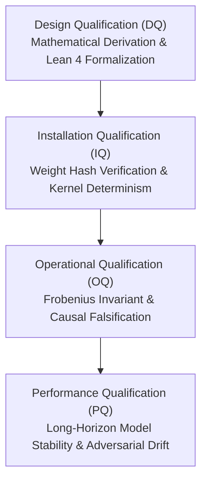

# Validation Master Plan (VMP-001)

**System:** GeoCSV-AI: Geometric Computer Systems Validation for AI  
**Validation Classification:** GAMP 5 Category 4 / FDA 21 CFR Part 11 Compliant  
**Document ID:** DOC-VAL-VMP-001-REV1  

---

## 1. Executive Summary

This Validation Master Plan (VMP) defines the verification life cycle, qualification strategy, and documentation structure for `GeoCSV-AI`. The software adapts pharmaceutical and aerospace validation principles to safety-critical artificial intelligence research.

---

## 2. Qualification Strategy (The 4Q Model)

1. **Design Qualification (DQ)**:
   - Validates that mathematical operators satisfy Lie algebra $\mathfrak{so}(d)$ properties and Sherman-Morrison-Woodbury identities.
   - Formally proved using Lean 4.
2. **Installation Qualification (IQ)**:
   - Automated audit verifying that model weights, CUDA drivers, and JIT AST graphs match baseline SHA-256 cryptographic hashes.
3. **Operational Qualification (OQ)**:
   - Rigorous automated property tests asserting that geometric invariants ($\|\mathbf{R}^T\mathbf{R} - \mathbf{I}\|_F < 10^{-6}$) and energy conservation are preserved under extreme inputs.
4. **Performance Qualification (PQ)**:
   - Stress testing over multi-token causal language generation and continuous robotic simulation.

---

## 3. Roles and Responsibilities

- **Principal Investigator**: Responsible for overall architecture, mathematical correctness, and formal theorem proofs.
- **Quality Engineer / CSV Specialist**: Responsible for audit trails, tamper-evident certificate issuance, and compliance with GAMP 5 / 21 CFR Part 11.
- **Contributors**: Required to adhere to the Requirements Traceability Matrix and pass all automated IQ/OQ suites before PR approval.
